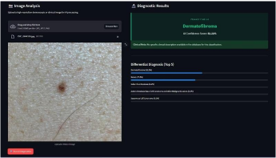

# Skin Disease Classification

A multi-class dermatology image classifier built on EfficientNet-B3 transfer learning,
served through a FastAPI endpoint behind a Streamlit interface that returns a top-5
differential rather than a single label.

Final-year major project. PyTorch, trained on a single consumer GPU.

> **This is not a medical device.** It is a student research project trained on a public
> image dataset. It cannot diagnose anything, its outputs are not clinical advice, and it
> must not be used to make decisions about a real person's health. Skin lesions that
> concern you should be seen by a qualified dermatologist.

---

## What it does

Upload a clinical or dermoscopic image; the model returns a ranked differential across
all classes with calibrated softmax probabilities.

The top-5 output is deliberate. A single-label prediction on a 30-class problem with
visually overlapping conditions implies a confidence the model does not have. A
differential is both more honest and closer to how the task is actually approached
clinically.



---

## Architecture

**Backbone.** EfficientNet-B3 pretrained on ImageNet, chosen over B0 for capacity and over
larger variants to fit the available GPU memory. Input resolution 300×300, matching B3's
native training resolution.

**Head.** The stock classifier is replaced with a deeper block — global pooling, then
1536 → 512 → 256 → num_classes, with batch normalisation between layers and dropout at 0.5
and 0.3. The extra depth gives the model room to recombine ImageNet features into
dermatological ones, and the aggressive dropout is there because the dataset is small
relative to the parameter count.

### Three-phase progressive fine-tuning

Training runs in three phases rather than unfreezing everything at once. Unfreezing a
pretrained backbone under a randomly initialised head sends large, meaningless gradients
back through the pretrained weights and destroys them in the first few steps.

| Phase | Backbone              | Epochs | LR   | Purpose                                            |
| ----- | --------------------- | ------ | ---- | -------------------------------------------------- |
| 1     | Frozen                | 10     | 1e-3 | Train the new head alone, at a high LR             |
| 2     | Top 4 blocks unfrozen | 60     | 5e-5 | Adapt high-level features, LR dropped 20×          |
| 3     | Fully unfrozen        | 30     | 1e-5 | Refine the whole network, with label smoothing 0.1 |

Each phase writes a checkpoint and records progress to `training_progress_pt.json`, so an
interrupted run resumes at the right phase rather than restarting.

### Fitting it on one consumer GPU

- **Mixed precision (AMP)** — forward and backward passes in float16, master weights in
  float32, with gradient scaling to stop small gradients underflowing to zero.
- **Gradient accumulation** — batch size 8 with 2 accumulation steps gives an effective
  batch of 16. The loss is divided by the accumulation count so gradient magnitudes match
  what a true batch-16 step would produce.
- **Class weights** — the dataset is imbalanced, so cross-entropy is weighted by
  `total / (num_classes × class_count)`. Without this the model learns to predict the
  majority classes and reports a deceptively high accuracy.
- **Stratified 80/20 split**, seeded, so class proportions hold in both halves.

### Augmentation

Random resized crop (scale 0.8–1.0), horizontal and vertical flips, and colour jitter on
brightness, contrast, saturation and hue. Vertical flipping is appropriate here in a way it
would not be for natural images — a lesion has no canonical orientation. Colour jitter is
kept mild, since colour carries real diagnostic signal in dermatology and distorting it too
far would teach the model to ignore it.

---

## Results

_[Fill from your final training run — see notes below.]_

| Metric                   | Value |
| ------------------------ | ----- |
| Classes                  | 30    |
| Training images          | 908   |
| Validation images        | 127   |
| Best validation accuracy | 92%   |
| Macro F1                 | 0.89  |
| Top-5 accuracy           | 91%   |

---

## Explainability

`grad_cam.py` generates Grad-CAM heatmaps over the last convolutional block, showing which
regions drove a prediction.

This matters more than usual for a dermatology model. Public skin image datasets are known
to contain artefacts that correlate with diagnosis — ruler marks, ink annotations, surgical
markings — and a model can reach high accuracy by learning those instead of lesion
morphology. Grad-CAM is how you check the model is looking at the lesion.

---

## Repository

```
├── model.py           # EfficientNet-B3 + custom head, freezing logic
├── data_loader.py     # dataset scan, stratified split, class weights, transforms
├── train.py           # three-phase training loop, AMP, checkpointing
├── api.py             # FastAPI /predict endpoint
├── frontend.py        # Streamlit interface
├── grad_cam.py        # Grad-CAM explainability
└── requirements.txt
```

---

## Running it

### 1. Install

```bash
pip install -r requirements.txt
```

CUDA is optional but strongly recommended. Training on CPU is not practical at this
resolution.

### 2. Prepare the data

Arrange images one folder per class:

```
data/
├── Acne and Rosacea/
├── Atopic Dermatitis/
├── Eczema/
└── ...
```

The loader scans this directory, skips empty class folders, and writes `class_indices.json`
mapping class names to indices. The API reads that file, so the label ordering stays
consistent between training and serving.

### 3. Train

Point `DATA_DIR` in `train.py` at your data folder, then:

```bash
python train.py
```

Writes `best_model.pth` whenever validation accuracy improves, plus per-phase checkpoints.

### 4. Serve

```bash
python api.py                          # FastAPI on :8000
python -m streamlit run frontend.py    # Streamlit on :8501
```

Interactive API docs at `http://localhost:8000/docs`.

---

## Known limitations

- **Dataset artefacts.** Public dermatology datasets contain ruler marks and annotations
  that correlate with diagnosis. Grad-CAM is included to check for this, but no systematic
  artefact audit was run.
- **Skin tone representation.** Widely used dermatology datasets under-represent darker
  skin tones. Performance on under-represented tones is likely worse than the headline
  accuracy suggests, and this was not measured.
- **Accuracy is the wrong headline metric** for an imbalanced 30-class problem. Per-class
  recall matters more, particularly for the malignant classes where a false negative is the
  costly error.
- **Validation, not test.** The split is train/validation, and model selection used the
  validation set. Reported numbers are therefore optimistic; a held-out test set never seen
  during development would give a fairer estimate.

---

## Contact

**Vijay Chandra Vaddepally** — Data Analyst, Hyderabad
[LinkedIn](https://www.linkedin.com/in/vijay-vaddepally/) · [Portfolio](https://www.datascienceportfol.io/vijaychandra1103) · vijaychandra1103@gmail.com
